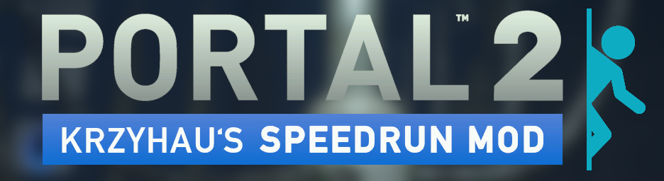

# Portal 2 Speedrun Mod

<div align="center">

[](https://sm.portal2.sr/)

</div>

<div align="center">

[](https://github.com/p2sr/Portal2SpeedrunMod/actions/workflows/CI.yml)
[](https://github.com/p2sr/Portal2SpeedrunMod/actions/workflows/Pages.yaml)

</div>

A mod for speedrunning Portal 2 with minimal downtime and support for alternate gamemodes.

For more information and installation instructions, please visit [the website].

[the website]: https://sm.portal2.sr/

## Contributing

### SMSM (Speedrun Mod Simple Modifier)

SMSM is a basic plugin that Speedrun Mod uses to handle modes and settings, as
well as some ad-hoc patches and hooks into the game.

1. Fork the repository
2. Clone your fork
3. Create a new branch
4. Make your changes
5. Create a pull request

#### Windows

You'll need:

- [Visual Studio Build Tools](https://visualstudio.microsoft.com/visual-cpp-build-tools/)
- Windows Universal C Runtime
- C++ Build Tools core features
- Windows 10 SDK (10.0.18362.0)
- MSVC v142 - VS 2019 C++ x64/x86 build tools

```batch
msbuild -m -p:"Platform=x86" SMSM.sln
```

#### Linux

You'll need:

- `g++-10-multilib`

```bash
make -j$(nproc)
```
